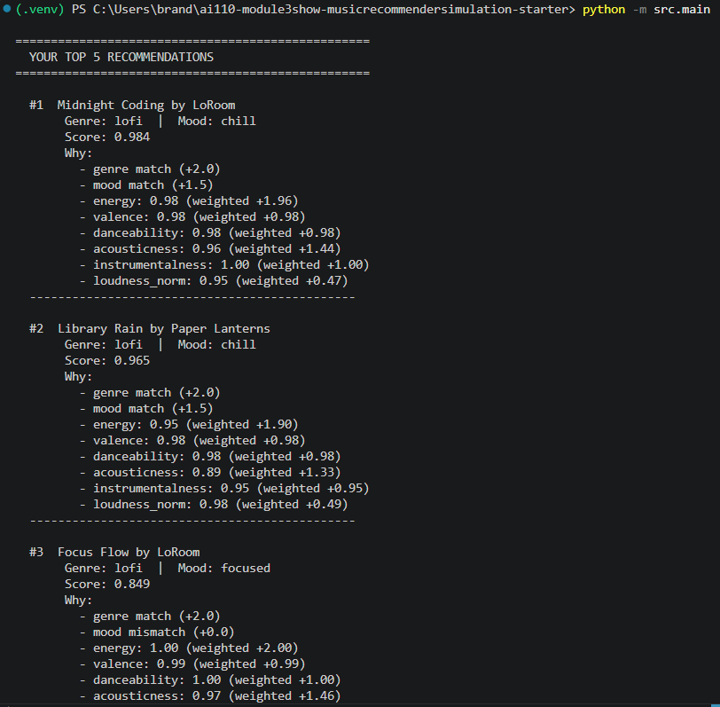
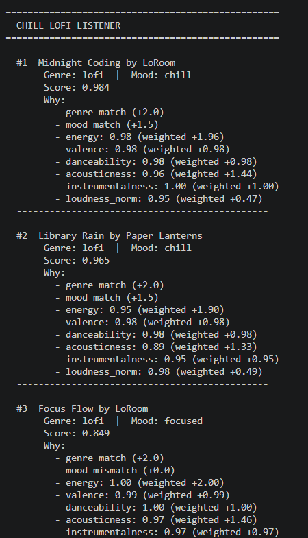
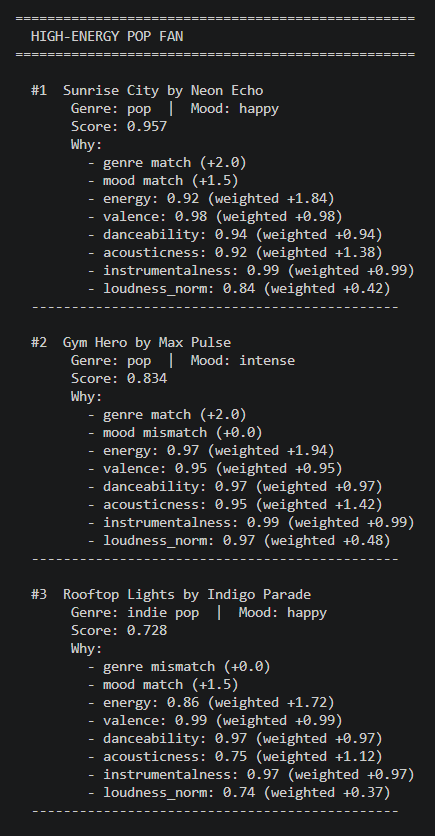
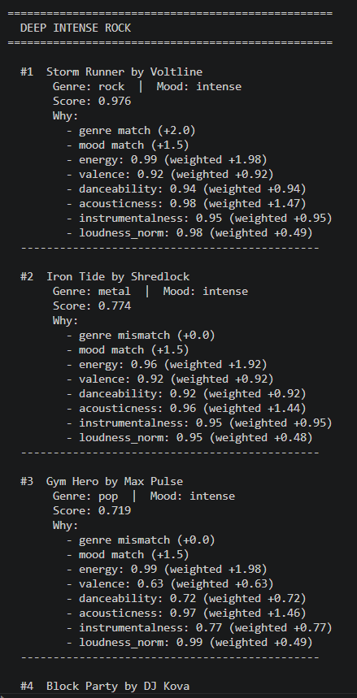
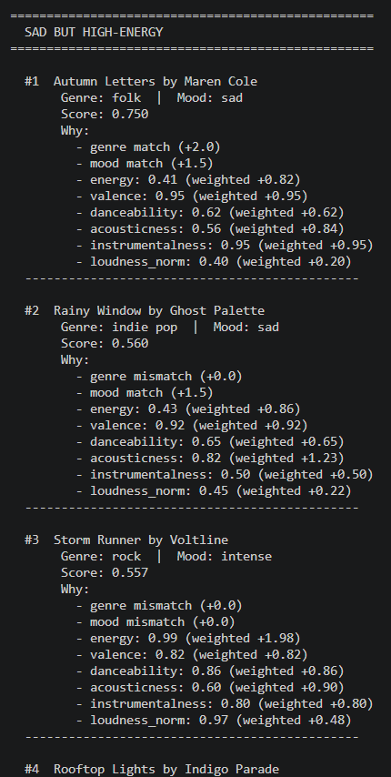
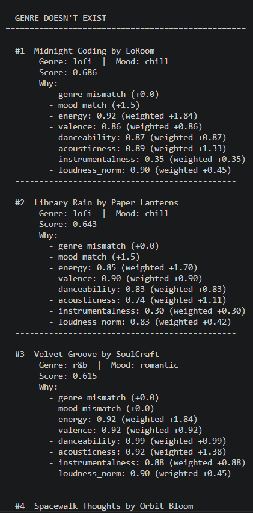
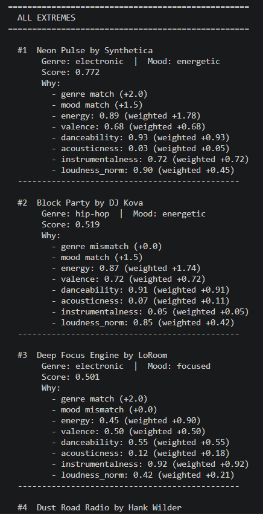

# 🎵 Music Recommender Simulation

## Project Summary

VibeFinder 1.0 is a content-based music recommender that scores 20 songs against a user's taste profile using genre, mood, energy, and other numeric features. It returns the top 5 matches with explanations for each score. We tested it with 6 user profiles, ran weight experiments to expose scoring flaws, and documented the biases we found in the model card.

---

## How The System Works

Apps like Spotify blend collaborative filtering with content-based filtering. Since we don't have millions of listeners, this simulation focuses on content-based filtering by matching song attributes directly to a user's taste profile.

Each `Song` carries: `genre`, `mood`, `energy`, `valence`, `danceability`, `acousticness`, `instrumentalness`, `loudness_norm`, and `tempo_bpm`.

Each `UserProfile` stores target values for the same features: `favorite_genre`, `favorite_mood`, `target_energy`, `target_valence`, `target_danceability`, `target_acousticness`, `target_instrumentalness`, `target_loudness_norm`, and `likes_acoustic`.

Algorithm Recipe:
1. Categorical scoring - Genre and mood are yes/no checks. A match scores 1.0, a mismatch scores 0.0.
2. Numeric proximity scoring - For each numeric feature: `score = 1 - |song_value - user_preference|`. A perfect match scores 1.0; the further apart, the lower the score.
3. Weighted combination - Each feature score is multiplied by a weight (e.g., genre = 2.0, energy = 2.0, loudness = 0.5) and divided by the total weight. This produces one final score between 0 and 1.
4. Ranking - Sort all songs by final score descending, return the top _k_.

Expected Biases:
Genre dominance - With genre weighted at 2.0, the system may rank a mediocre lofi track above a folk song that perfectly matches the user's energy and mood. Lowering genre weight fixes this but loosens recommendations.
Filter bubble - Content-based filtering only recommends songs similar to what the user already likes. It will never surface a surprising cross-genre discovery the way collaborative filtering would.
Catalog bias - The system can only recommend what's in the dataset. If most songs are chill/lofi, energetic users get weaker results regardless of scoring quality.
Equal feature treatment - The 0-to-1 proximity formula treats all distances the same. In reality, a 0.1 difference in energy might matter more than a 0.1 difference in valence.









---

## Getting Started

### Setup

1. Create a virtual environment (optional but recommended):

   ```bash
   python -m venv .venv
   source .venv/bin/activate      # Mac or Linux
   .venv\Scripts\activate         # Windows

2. Install dependencies

```bash
pip install -r requirements.txt
```

3. Run the app:

```bash
python -m src.main
```

### Running Tests

Run the starter tests with:

```bash
pytest
```

You can add more tests in `tests/test_recommender.py`.

---

## Experiments You Tried

Weight shift: Doubled energy weight (2.0 to 4.0) and halved genre weight (2.0 to 1.0). This fixed the "Sad but High-Energy" problem. Storm Runner jumped to #1 instead of a quiet folk ballad. Labels stopped dominating and the system started caring more about how a song actually sounds.
Adversarial profiles: Tested a user who wants reggae (no matches in catalog) and one who maxes out every feature. The reggae user got low-confidence results (~0.68 vs the usual 0.95+). The all-extremes user exposed contradictions. You can't be fully acoustic and fully electronic at the same time, and the system couldn't say that.
Profile comparisons: Compared lofi vs pop, pop vs rock, and lofi vs sad-but-energetic. The interesting finding was that Gym Hero kept showing up for both the pop fan and the rock fan because its high energy worked for both, even though the mood was wrong for pop.

---

## Limitations and Risks

- 20 songs in the catalog
- Some genres have 1 song, so the system can't give meaningful variety for those users
- Genre weight (2.0) dominates scoring. A mediocre genre match beats a song that nails energy and mood but has the wrong label.
- Content-based filtering creates a filter bubble. It only recommends what you already like and will never surface a cross-genre surprise.
- The system doesn't understand lyrics, language, or cultural context. Two "happy" songs can feel completely different and it wouldn't know.
- The proximity formula treats all 0.1 gaps equally. A 0.1 difference in energy probably matters more than a 0.1 difference in valence, but the system can't tell.

---

## Reflection

Read and complete `model_card.md`:

[**Model Card**](model_card.md)

Write 1 to 2 paragraphs here about what you learned:

- about how recommenders turn data into predictions
- about where bias or unfairness could show up in systems like this

Recommenders turn data into predictions by measuring distance between scores but the weights we assign to each feature quietly decides which distance mattes more. Weighting genres at 2.0 means a lofi track can outrank a folk song that perfectly matches the energy and mood. The math of the algorith mis neutral but the weighting isn't. Our opinions on what matters the most get engraved in the formula and make it an "objective" score. 

Bias shows up in unexpected places like the catalog. Since there are 3 lofi songs but only 1 hip-hop track, the system serves some users better than others before the algorithm even comes into play. Content-based filtering is also a bubble by design as it only recommends tracks that resemble the user's current taste. It won't push users towards new types of musics. If this were a real product, users with niche or cross-genre taste would get worse recommendations than users who fit neatly into one box.

---

## 7. `model_card_template.md`

Combines reflection and model card framing from the Module 3 guidance. :contentReference[oaicite:2]{index=2}  

```markdown
# 🎧 Model Card - Music Recommender Simulation

## 1. Model Name

Give your recommender a name, for example:

> VibeFinder 1.0

---

## 2. Intended Use

- What is this system trying to do
- Who is it for

Example:

> This model suggests 3 to 5 songs from a small catalog based on a user's preferred genre, mood, and energy level. It is for classroom exploration only, not for real users.

---

## 3. How It Works (Short Explanation)

Describe your scoring logic in plain language.

- What features of each song does it consider
- What information about the user does it use
- How does it turn those into a number

Try to avoid code in this section, treat it like an explanation to a non programmer.

---

## 4. Data

Describe your dataset.

- How many songs are in `data/songs.csv`
- Did you add or remove any songs
- What kinds of genres or moods are represented
- Whose taste does this data mostly reflect

---

## 5. Strengths

Where does your recommender work well

You can think about:
- Situations where the top results "felt right"
- Particular user profiles it served well
- Simplicity or transparency benefits

---

## 6. Limitations and Bias

Where does your recommender struggle

Some prompts:
- Does it ignore some genres or moods
- Does it treat all users as if they have the same taste shape
- Is it biased toward high energy or one genre by default
- How could this be unfair if used in a real product

---

## 7. Evaluation

How did you check your system

Examples:
- You tried multiple user profiles and wrote down whether the results matched your expectations
- You compared your simulation to what a real app like Spotify or YouTube tends to recommend
- You wrote tests for your scoring logic

You do not need a numeric metric, but if you used one, explain what it measures.

---

## 8. Future Work

If you had more time, how would you improve this recommender

Examples:

- Add support for multiple users and "group vibe" recommendations
- Balance diversity of songs instead of always picking the closest match
- Use more features, like tempo ranges or lyric themes

---

## 9. Personal Reflection

A few sentences about what you learned:

- What surprised you about how your system behaved
- How did building this change how you think about real music recommenders
- Where do you think human judgment still matters, even if the model seems "smart"

